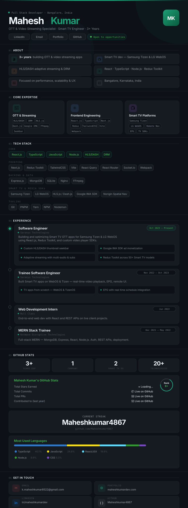

<!--
  ╔══════════════════════════════════════════════════════════════╗
  ║  HOW TO USE THIS README                                      ║
  ║                                                              ║
  ║  1. Upload profile.svg to this same repo (root folder)       ║
  ║  2. The README auto-renders your full dark UI as an image    ║
  ║  3. All links still work via the clickable badges below      ║
  ╚══════════════════════════════════════════════════════════════╝
-->

 

